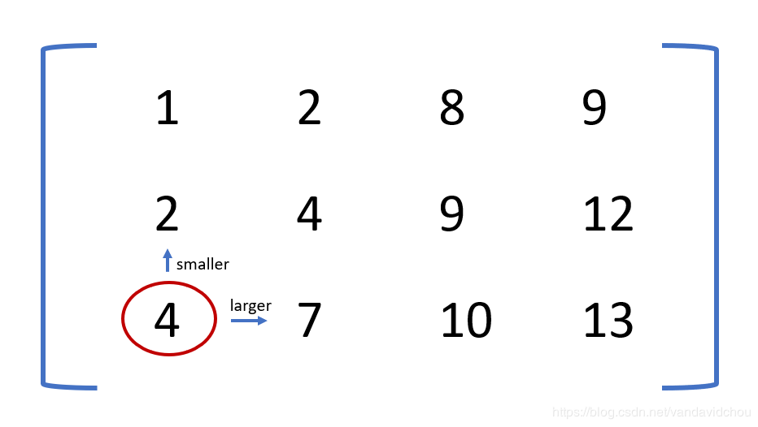
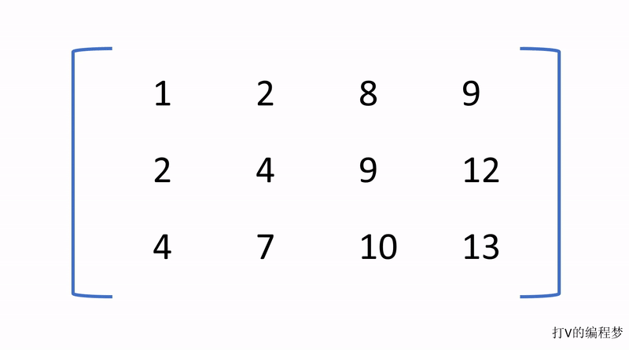

- [题目描述](#题目描述)
- [分析](#分析)
- [算法](#算法)
  * [动图演示](#动图演示)
  * [Java代码](#java代码)
  * [算法效率分析](#算法效率分析)

# 题目描述
在一个二维数组中（每个一维数组的长度相同），每一行都按照从左到右递增的顺序排序，每一列都按照从上到下递增的顺序排序。请完成一个函数，输入这样的一个二维数组和一个整数，判断数组中是否含有该整数。

# 分析
根据题目描述，我们的二维数组长这样：



仔细观察这个数组可以发现，左下的元素 (4) 有一个特性，那就是右边的元素都比它大，上面的元素都比它小。这种特殊的元素给我们提供了一个**非常好的查找路径**，我们可以通过比较元素，如果当前元素比目标值小的话，我们就向右边的路径行走，继续查找较大的元素，反之我们就向上的路径行走。

# 算法
利用其特性，我们的算法就是从左下的元素开始，比较当前元素与目标值，如果当前元素小于目标值，我们移动到右边的元素，再次进行比较。反之，我们移动到上方的元素，并再次进行比较。该过程将持续到我们找到目标值，或移动到数组边界为止。

## 动图演示


## Java代码

```java
public class Solution {
    public boolean Find(int target, int [][] array) {
        int rows = array.length;
        int cols = array[0].length;

		// 此为左下角元素的位置
        int i = rows - 1;
        int j = 0;

        while (i >= 0 && j < cols) {
            int value = array[i][j];

            if (target == value) {
                return true;
            }

            if (target < value) {
            	// 如果当前元素大于目标值，向上移动
                i--;
            } else {
            	// 如果当前元素小于目标值，向右移动
                j++;
            }
        }
        return false;
    }
}
```

## 算法效率分析
从动图中可以看出，这种算法每一次都会排除一行或者一列，那么在最坏的情况下就是会遍历所有的行列，因此算法的效率为：

```
O (M + N)
```

其中 M 为行数，N 为列数。
