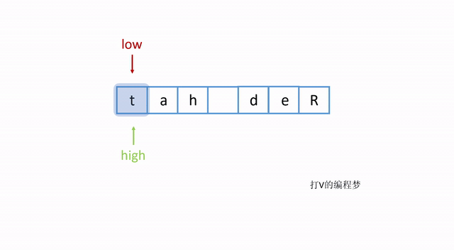

- [题目描述](#题目描述)
  * [例子](#例子)
- [解题思路](#解题思路)
  * [优化空间](#优化空间)
  * [特征分析](#特征分析)
- [算法](#算法)
  * [算法动画](#算法动画)
  * [算法代码](#算法代码)
  * [算法效率分析](#算法效率分析)

# 题目描述
牛客最近来了一个新员工Fish，每天早晨总是会拿着一本英文杂志，写些句子在本子上。同事Cat对Fish写的内容颇感兴趣，有一天他向Fish借来翻看，但却读不懂它的意思。例如，“student. a am I”。后来才意识到，这家伙原来把句子单词的顺序翻转了，正确的句子应该是“I am a student.”。Cat对一一的翻转这些单词顺序可不在行，你能帮助他么？

## 例子
```java
输入： I am a student.
输出： student. a am I
```

```java
输入： Hello
输出： Hello
```

# 解题思路
## 优化空间
虽然我们可以将句子里的单词提取出来，再用倒序的方式重新组装句子，但是这种方法会需要用到额外的空间，所以这不是很理想的方法。假设我们的句子很长并且有1GB，那么为了翻转这个句子计算机还得再额外分配1GB的空间才能让我们放置提取出来的单词。

**有没有什么方法是不需要额外的内存空间呢？**

有的，我们需要直接在字符数组上面直接操作交换字符的位置，这样我们就不需要额外分配空间，而可以直接利用当前字符数组的空间（in-place）。

**需要注意的地方：**
如果是使用Java语言，由于传入的参数是String，以及String本身是immutable object，所以我们无论如何还是要额外分配空间给一个 char array。但是我们的算法还是应该专注于在这个 char array 上面直接进行操作，而不再额外分配除此 char array 之外的空间。

## 特征分析
首先我们知道，被翻转的句子，他们的单词位置会倒过来，那么我们可以先将整个句子翻转过来，这样每个单词都会处在正确的位置上。

此时，**每个单词已经在正确的位置上了。现在唯一的问题是，单词本身的字母顺序是颠倒的**。

我们可以再遍历一次字符数组，将单词翻转过来，这样就完成了。

# 算法
根据我们的分析，我们的算法可以分为两步：

1. 将整个句子翻转。
2. 将各个单词分别翻转。

这样算法不仅效率高，也很直观易懂，是比较推荐的算法。

## 算法动画
将整个句子翻转：


将每个单词翻转：



这样一来就完成了。

## 算法代码

```java
public static String solution(String str) {
    char[] chars = str.toCharArray();

    // 翻转整个句子
    chars = flipChars(chars, 0, chars.length - 1);

    // 翻转各个单词
    int start = 0;
    int end = chars.length - 1;
    for (int i = 0; i < chars.length; i++) {
    	// 除了最后一个单词，所有单词均以空格结尾
        if (chars[i] == ' ') {
            end = i - 1;
            chars = flipChars(chars, start, end);
            start = i + 1;
        } else if (i == chars.length - 1) {
            end = i;
            chars = flipChars(chars, start, end);
        }
    }
    String result = new String(chars);
    return result;
}

// 翻转字符数组的函数
public static char[] flipChars(char[] chars, int start, int end) {
    while (end >= start) {
        char temp = chars[end];
        chars[end] = chars[start];
        chars[start] = temp;
        end--;
        start++;
    }
    return chars;
}
```

## 算法效率分析
- 翻转句子需要遍历数组一次
- 翻转单词也需要遍历数组一次
- 翻转操作的效率不受数组长度影响

**算法效率：O (n)**

其中 n 为数组长度。
