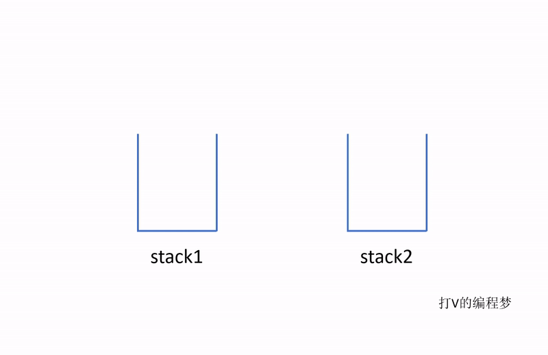
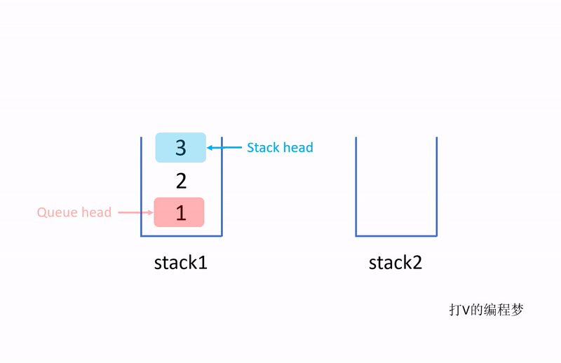

- [题目描述](#题目描述)
- [解题思路](#解题思路)
- [算法](#算法)
  * [算法步骤](#算法步骤)
  * [算法代码](#算法代码)
  * [算法效率](#算法效率)
  
# 题目描述

用两个栈来实现一个队列，完成队列的Push和Pop操作。 队列中的元素为int类型。

# 解题思路

首先我们要先明确栈(stack)与队列(Queue)的性质：

- 栈：后进先出 (LIFO)
- 队列： 先进先出 (FIFO)

这个时候我们要用两个栈来实现队列，就要先看看元素在栈里的情况为何。



由图可见，**栈的头与队列的头刚刚好是相反的两个端点**。

如果我们要实现队列，我们需要把队列的头调转过来，变成第一个出去的元素。刚好我们有另一个栈可以帮助我们完成这点。

其实就像我们把一个杯子的米倒进另一个杯子里一样，原本在下面的米就会跑到上面来。



由以上动图可见，当我们把全部元素从stack1取出，并同时压入stack2之后，队列的头就会变成在上面。这时候我们直接对stack2进行pop()操作，取出的元素顺序也就跟队列的取出顺序一样了。

# 算法

当我们压入元素时，直接将元素压入stack1。当我们要取出元素时，直接从stack2里取出元素，如果stack2里没有元素，则把stack1里的元素倒进stack2，然后再从stack2取出元素即可。

## 算法步骤

1. 压入元素时直接压入stack1
2. 取元素时先检查stack2是否为空。
3. 如果stack2为空，则将stack1的元素逐个取出，并压入stack2。
4. 接着从stack2里取出元素。

## 算法代码

```java
public void push(int node) {
    // 直接压入stack1
    stack1.push(node);
}

public int pop() {
    // 如果stack2空了，则把stack1的元素倒进stack2，
    // 否则直接从stack2中取元素即可
    if (!stack2.isEmpty()) {
        return stack2.pop();
    } else {
        fillStack2();
        return stack2.pop();
    }
}

// 将stack1的元素倒进stack2
private void fillStack2() {
    while (!stack1.isEmpty()) {
        int num = stack1.pop();
        stack2.push(num);
    }
}
```

## 算法效率

平摊效率： O(1)

虽然我们需要将stack1的元素全部取出再存入stack2，但如果我们只有当stack2空了之后才这么做的话，这种操作也就不会经常发生。因此，平摊下来的效率相当于O(1)，也就是与一个正常的队列一样的效率。当然，正常的队列会少一些消耗，这里说的两者效率一样是从上界Big O的角度来看的。
