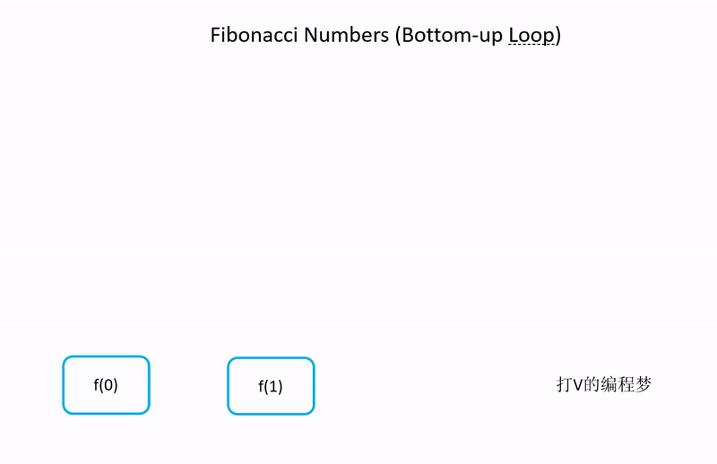

- [题目描述](#题目描述)
- [什么是斐波那契数列](#什么是斐波那契数列)
  * [实现方法1：递归 O(2^n)](#实现方法1：递归%20O(2^n))
  * [实现方法2：从底层开始循环计算 O(n)](#实现方法2：从底层开始循环计算%20O(n))
  * [实现方法3：动态规划 O(n)](#实现方法3：动态规划%20O(n))
  * [其他实现方法](#其他实现方法)

斐波那契数列是一道非常经典的面试题，因为它考察了面试者是否理解递归的缺点，以及如何分析递归的效率。

本文将结合动画详细分析3种常见的实现生成斐波那契数列函数的方法。

# 题目描述
大家都知道斐波那契数列，现在要求输入一个整数n，请你输出斐波那契数列的第n项（从0开始，第0项为0）。
n<=39

举例：
```
第 1 个斐波那契数列为 1

输入： 1
输出： 1
```
```
第 7 个斐波那契数为 13

输入： 7
输出： 13
```

# 什么是斐波那契数列
所谓的斐波那契数列，就是**数列中的每个数都是前两数的和**。


根据定义，我们可以得到如下数列：

```
[0, 1, 1, 2, 3, 5, 8, 13, ...]
```

## 实现方法1：递归 O(2^n)
从上面的斐波那契数列定义中可以发现，这是一个递归定义。因此，我们也可以写一个递归函数来计算斐波那契数列的值。

```java
// 递归求斐波那契数列
public int getFib(int n) {
	// 基本情况
    if (n <= 0) {
        return 0;
    } else if (n == 1) {
        return 1;
    }

	// 递归公式
    return getFib(n-1) + getFib(n-2);
}
```

从上述代码中我们可以看出，使用递归方式写代码的好处就是简洁易懂，同时也是最自然的一种写法，但是**运行效率非常低**。

**递归效率 O(2^n)**

如果我们展开递归树就会发现，有**很多斐波那契数被重新计算了许多遍**。因此，递归的效率是很低的，如果我们计算的 n 值非常大，那么就得花费很长的时间才能得到结果。大家可以试试看计算 n = 45。


效率推导过程如下：

```
求第 n 个斐波那契数所需的时间等于 取第 n - 1 个与第 n - 2 个的时间之和

T(n) = T(n-1) + T(n-2) + O(1)

由于 T(n - 1) ~= T(n - 2)
得
T(n) = 2T(n-1) + O(1)

根据递归公式，我们知道 T(n-1) = 2T(n-2) + O(1)
因此

T(n) 
= 2T(n-1) + O(1)
= 2(2T(n-2)) + O(1)
= 4(2T(n-3)) + O(1)
= 8(2T(n-4)) + O(1)
= 2^n
```

## 实现方法2：从底层开始循环计算 O(n)
给定：
- f(0) = 0
- f(1) = 1

我们从 f(2) 开始使用循环**一路往上叠加计算**。

**循环效率： O(n)**

由图中可见，从下自上的循环不会出现重复计算的情况，每个数字会遍历一次，因此效率为 O(n)。


```java
// 循环
public int getFib(int n) {
	// 首两个斐波那契数数
    int f0 = 0;
    int f1 = 1;

    if (n == 0) {
        return f0;
    } else if (n == 1) {
        return f1;
    }

    int j = f0;
    int k = f1;
    int result = 0;
    // 一路循环往上叠加
    for (int i = 0; i < n - 1; i++) {
        result = j + k;
        j = k;
        k = result;
    }
    return result;
}
```

## 实现方法3：动态规划 O(n)
动态规划就是将之前求到的解存起来，以后还需要再用到的时候直接从内存提取结果，而不需要再次计算。

如果我们多次计算斐波那契数列的话，则可以储存之前已经计算过的结果，避免重新计算。如此一来，**平均效率会达到 O(n)**。缺点则是会牺牲一些空间来储存之前的计算结果。


```java
// 动态规划
// Map 储存之前的结果
private Map<Integer, Integer> fibNumbers = new HashMap(); 
public int getFibDp(int n) {
    if (n == 0) {
        fibNumbers.put(0, 0);
        return 0;
    } else if (n == 1) {
        fibNumbers.put(1, 1);
        return 1;
    }

    if (fibNumbers.get(n) != null) {
    	// 如果之前已经计算过结果，直接返回
        return fibNumbers.get(n);
    } else {
    	// 	否则，进行递归计算并储存结果
        int result = getFibDp(n-1) + getFibDp(n-2);
        fibNumbers.put(n, result);
        return result;
    }
}
```
## 其他实现方法
其实还由很多其他的实现方法，但比较少用所以就不在这里描述。

值得一提的时，我们也可以利用斐波那契数列的母函数 (Generating Function) 直接套公式求出值来。这个方法的优点是效率高，无论 n 值有多大，计算速度都不会发生改变，也就是 O(1) 的效率。

然而缺点也是显而易见的，母函数的公式较为复杂，并且计算时存在浮点运算与误差值的问题。
