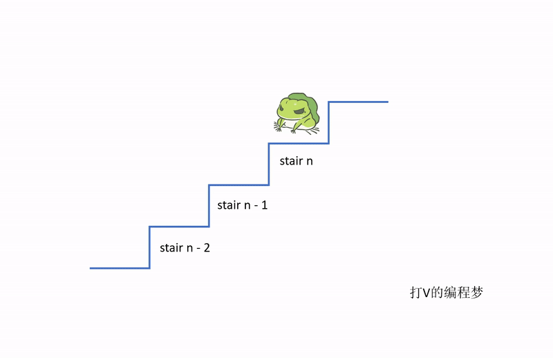
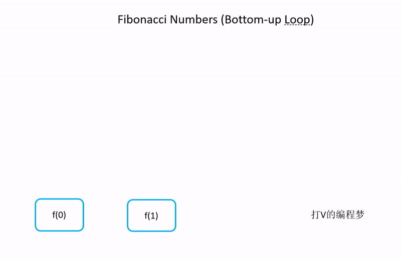

- [题目描述](#题目描述)
- [解题思路](#解题思路)
- [算法](#算法)
  * [由下自上的循坏算法 O(n)](#由下自上的循坏算法%20O(n))
  * [算法效率](#算法效率)

通过刷题剑指offer，可以有效提升面试成功的概率，这是因为技术岗位的面试总是离不开算法题。如果想要在算法题方面表现得好的话，刷题是唯一的捷径。

正所谓：书山有路勤为径

# 题目描述

一只青蛙一次可以跳上1级台阶，也可以跳上2级。求该青蛙跳上一个n级的台阶总共有多少种跳法（先后次序不同算不同的结果）。

# 解题思路

这类的题型与算术有关系，我们可以这样思考：

我站在第 n 个台阶上，那么我上一步可能在哪个台阶上？ 

由于**每次可以跳1个台阶或2个台阶**，因此我们上一步可能来自：

- 第 n -1 个台阶

- 第 n -2 个台阶

因为**只有在这两个台阶上，我才有可能跳到第 n 个台阶**。

所以，在第 n 个台阶上，它可能的跳法取决于前两个台阶，因此它的跳法总和为：

第 n - 1 个台阶的跳法 + 第 n - 2 个台阶的跳法

看到这里，有没有发现这和斐波那契数列很相像？

[斐波那契数列传送门](../04.斐波那契数列/斐波那契数列.md)

# 算法

解这道题的方法与解斐波那契数列的方法一样。我们有3种常见的实现方法，这些方法的优缺点以及效率都在斐波那契数列那篇文章上做了详细的分析，我们这里就只给出从下自上的循坏算法，因为这个算法效率较高。

感兴趣的朋友可以点下方的传送门取阅读斐波那契数列的文章：

[斐波那契数列传送门](../04.斐波那契数列/斐波那契数列.md)



## 由下自上的循坏算法 O(n)

```java
public int JumpFloor(int target) {
    // 定义最开始3个台阶所需步数
    int step0 = 0;
    int step1 = 1;
    int step2 = 2;

    if (target == 0) {
        return step0;
    } else if (target == 1) {
        return step1;
    } else if (target == 2) {
        return step2;
    }

    // 循坏计算 f(n) = f(n-1) + f(n-2)
    int result = 0;
    for (int i = 0; i < target - 2; i++) {
        result = step1 + step2;
        step1 = step2;
        step2 = result;
    }

    return result;
}
```

## 算法效率

效率：O(n)

从下自上的循坏算法会一个一个数往上计算，每个数都只会遍历一遍而已。可参考斐波那契数列由下自上的算法。


