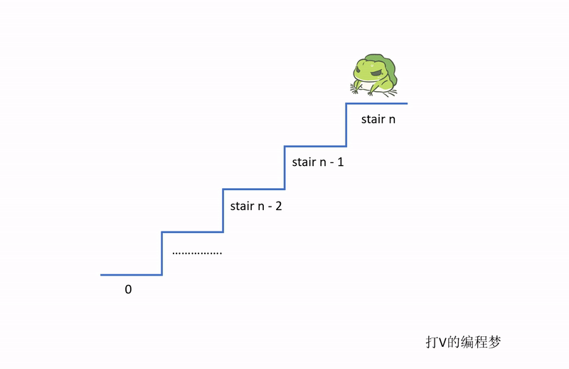

- [题目描述](#题目描述)
- [解题思路](#解题思路)
- [算法](#算法)
  * [总结规律](#总结规律)
  * [算法代码](#算法代码)
  * [算法效率](#算法效率)

通过刷题剑指offer，可以有效提升面试成功的概率，这是因为技术岗位的面试总是离不开算法题。如果想要在算法题方面表现得好的话，刷题是唯一的捷径。

正所谓：书山有路勤为径

# 题目描述

一只青蛙一次可以跳上1级台阶，也可以跳上2级……它也可以跳上n级。求该青蛙跳上一个n级的台阶总共有多少种跳法。

# 解题思路

这题的思路与我们之前的这篇文章[跳台阶](../05.跳台阶/跳台阶.md)很像，只不过这一次青蛙想跳多高就可以跳多高，真是好腿力。想看详细分析的同学可以读这篇文章，这里我们直接说结论。

在第 n 个台阶上，往回推算的话，青蛙可以从第 0 个台阶，第 1 个台阶，...，一直到第 n-1 个台阶都能跳到第 n 个台阶。所以，第 n 个台阶的跳法总和等于 第 0, 1, ..., n-1 个台阶的跳法总和，另外再加上1种跳法，就是从第 0 个台阶直接跳到第 n 个台阶。

公式：

s(n) 表示从第 0 个台阶跳到第 n 个台阶的跳法总和

**s(n) = s(0) + s(1) + s(2) + ... + s(n-1) + 1**




# 算法

根据上述的公式，如果我们将每个台阶的可能跳法数列出来，就会发现它们其实是有规律的。

| stair | steps | 
|---|---|
| 0  | 0  |
| 1  | 1  |
| 2  | 2  |
| 3  | 4  |
| 4  | 8  |
| 5  | 16  |
| 6  | 32  |
 
举个例子，第 4 个台阶的算法为：

s(4) = s(0) + s(1) + s(2) + s(3) + 1
s(4) = 0 + 1 + 2 + 4 + 1
s(4) = 8

## 总结规律

从表格中可以发现，从第 2 个台阶开始，跳法都是 2 的平方数。

因此，我们可以得到如下公式：

**2^(n-1), where n > 1, n 表示第 n 个台阶**

## 算法代码

由于我们知道答案都是2的平方数，因此我们可以利用 << 比特操作来加快计算速度。这是因为比特操作的速度比单纯的数学操作还要快。

```java
public static int JumpFloorII(int target) {
    if (target == 0) {
        return 0;
    }

    // 此处base为1是因为比特左位移 << 操作实际上等于乘以2
    // 因此，当 n = 1 时，我们有 base = 1 = 2^0
    // 当 n = 2 时， base * 2 = 2 = 2^1
    int base = 1;
    int result = base << (target - 1);
    return result;
}
```

## 算法效率

**效率： O(1)**

虽然说台阶数越高，就要向左比特位移更多次，但由于比特操作速度很快，我们可以将其看成一个固定的时间开销。因此，该算法的效率为 O(1)。
