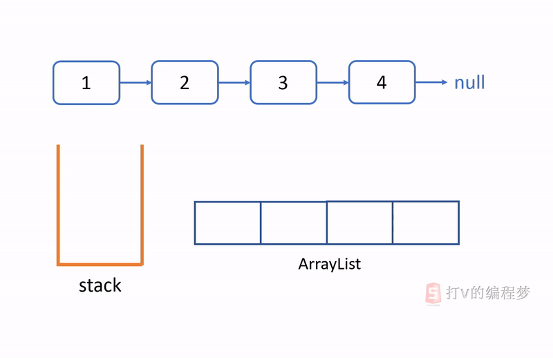

- [题目描述](#题目描述)
- [解题思路](#解题思路)
- [算法](#算法)
  * [算法代码](#算法代码)
  * [算法动图](#算法动图)
  * [算法效率](#算法效率)

通过刷题剑指offer，可以有效提升面试的成功率，这是因为技术岗位的面试总是离不开算法题。如果想要在算法题方面表现得好的话，刷题是唯一的捷径。

正所谓：书山有路勤为径

# 题目描述

输入一个链表，按链表从尾到头的顺序返回一个ArrayList。

# 解题思路

题目给了我们一个单向链表，我们需要反向输出每个节点的值。然而，单向链表的一个特点就是只能正向遍历，无法反向遍历，因为每个节点只有指向下一个节点的指针，并没有指向上一个节点的指针，所以无法访问上一个节点。

既然我们没有办法一边遍历链表节点，一边输出节点的值，那么我们是否可以先把每个节点的值储存起来，最后再将他们颠倒过来呢？

有一个数据结构的特性非常符合我们的要求，那就是**栈** (**stack**)。

由于**栈有后进先出的特点**，我们只需要将所有节点的值压入栈里，然后再依次弹出，它们的顺序就会被颠倒过来了。

# 算法

算法的基本步骤可以分解为：

1. 创建一个栈
2. 遍历链表并将节点的值压入栈
3. 创建一个ArrayList
4. 将栈里的元素弹出并插入到ArrayList里，直到栈为空

## 算法代码

```java
import java.util.ArrayList;
import java.util.Stack;

public static ArrayList<Integer> printListFromTailToHead(ListNode listNode) {
    Stack<Integer> stack = new Stack<>();

    while (listNode != null) {
        stack.push(listNode.val);
        listNode = listNode.next;
    }

    ArrayList<Integer> arrayList = new ArrayList<>();

    while (!stack.isEmpty()) {
        int val = stack.pop();
        arrayList.add(val);
    }

    return arrayList;
}
```

## 算法动图



## 算法效率

效率：O(n)

n 代表链表节点的个数。

遍历 n 个节点，压入 n 个节点入栈，从栈里弹出 n 个节点并插入ArrayList中。因此，效率为 O(n)。
