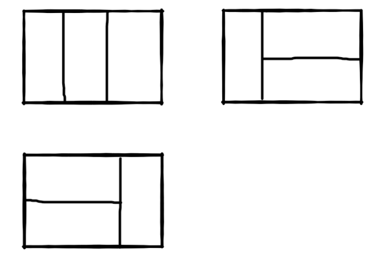
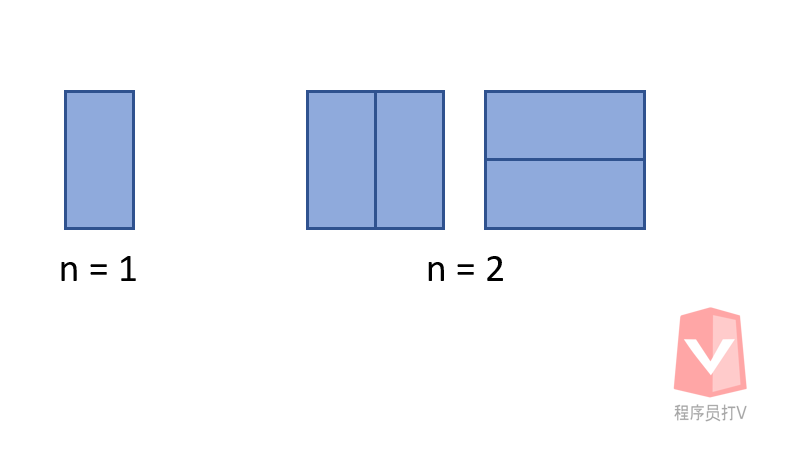
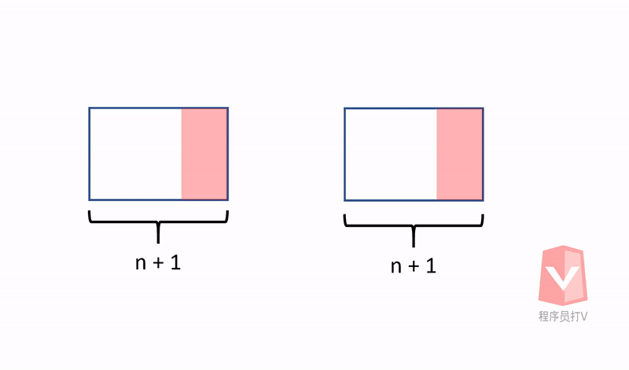

- [题目描述](#题目描述)
- [解题思路](#解题思路)
- [算法](#算法)

通过刷题剑指offer，可以有效提升面试的成功率，这是因为技术岗位的面试总是离不开算法题。如果想要在算法题方面表现得好的话，刷题是唯一的捷径。

正所谓：书山有路勤为径

# 题目描述

我们可以用2x1的小矩形横着或者竖着去覆盖更大的矩形。请问用n个2x1的小矩形无重叠地覆盖一个2xn的大矩形，总共有多少种方法？

比如n=3时，2x3的矩形块有3种覆盖方法：



# 解题思路

这一题可以用递归的思想来解决。首先我们先来看看几个基本情况下，有几种覆盖方法。



从图中可以看到，当 n = 1 的时候，我们有一种覆盖方法，当 n = 2 的时候，我们有两种覆盖方法。

这个时候我们可以**运用递归的思维，思考当 n + 1 的时候会发生什么事情？**



由上图可见，当我们要尝试覆盖多出来的一块 2x1 区域时，我们可以有**两种摆法**，分别是**竖着摆放一块 2x1 的矩形，或是横着摆放两块 2x1 的矩形**，而这**分别又取决于 n 与 n - 1 的覆盖方法**。

因此我们可以得出结论：

**f(n+1) = f(n) + f(n-1)**

# 算法

根据公式：

**f(n+1) = f(n) + f(n-1)**

可以看出来这是一个递归公式。因此我们可以直接写一个递归函数

```java
// 递归效率： O(2^n) 效率不理想
public int RectCover(int target) {
    if (target == 0) {
        return 0;
    } else if (target == 1) {
        return 1;
    } else if (target == 2) {
        return 2;
    }

    return RectCover(target - 1) + RectCover(target - 2);
    
}
```

然而该递归函数的效率不是很理想，我们可以改成循坏的方法来改进算法的效率。

```java
// 循环效率： O(n) 效率理想
public int RectCover(int target) {
    if (target == 0) {
        return 0;
    } else if (target == 1) {
        return 1;
    } else if (target == 2) {
        return 2;
    }

    int temp1 = 1;
    int temp2 = 2;
    int result = 0;
    
    for (int i = 2; i < target; i++) {
        result = temp1 + temp2;
        temp1 = temp2;
        temp2 = result;
    }
    
    return result;
}
```

至于为什么递归效率比较差，读者们可以参考我们之前的[斐波那契数列的分析文章](../04.斐波那契数列/斐波那契数列.md)，里面有关于递归方面题目的分析，值得一读。
