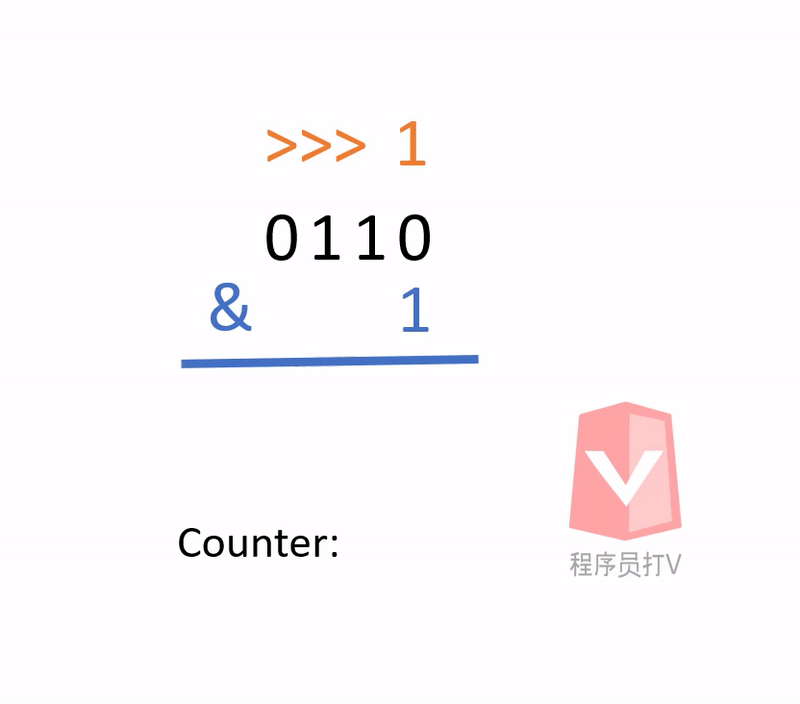

- [题目描述](#题目描述)
- [解题思路](#解题思路)
- [算法](#算法)
  * [算法动图](#算法动图)
  * [算法代码](#算法代码)
  * [算法效率](#算法效率)

通过刷题剑指offer，可以有效提升面试的成功率，这是因为技术岗位的面试总是离不开算法题。如果想要在算法题方面表现得好的话，刷题是唯一的捷径。

正所谓：书山有路勤为径

# 题目描述

输入一个整数，输出该数二进制表示中1的个数。其中负数用补码表示。

# 解题思路

根据题目我们可以判断这道题与**位操作**（bitwise operation）有关，因为题目要我们判断**二进制**中1的个数，所以一定要通过位操作来解决。

首先，我们需要一个Bit Mask用来与输入的整数进行位操作，我们可以选取整数1作为我们的Bit Mask，因为整数1的二进制除了最后一位比特为1之外，其余都为0，刚好可以让我们用来验证输入的整数**最后一位比特**是0还是1。

那么我们的位操作符就可以选则 & （and）操作。如此一来，如果我们得到的位操作结果为1，就表示最后一位比特是1，否则为0。

举例：

```
0101   // 输入的整数
0001 & // bit mask
-----
0001 // 得知最后一位比特为 1

0100
0001 &
-----
0000 // 得知最后一位比特为 0
```

验证完最后一位比特之后，我们可以做 >>> 向右比特位移的操作，如此一来倒数第二位的比特就会变成在最后一位的位置上，这样我们就可以继续用整数1作为Bit Mask来进行位操作。

举例：

```
0101 >>> 1 // 向右位移一位
得到 0010
```

由此可见，当输入的整数变成0之后（0000），我们就清点完了所有的比特1了。

**注意：向右位移的操作必须使用 >>>，不可以使用 >>。因为 >> 操作是带符号的，如果我们输入的整数是负数，则左边的填充会用比特1来填充，就会造成不断有新的比特1出现的问题。**

举例:

```
1011 >> 1 // 此数为负数，因为最左边一位比特为1
得到 1101
```

# 算法

## 算法动图



## 算法代码

根据上面的分析，我们可以直接上代码：

```java
public int NumberOf1(int n) {
    int counter = 0;
    int bitMask = 1;
    
    while (n != 0) {
        
        if ((n & bitMask) == 1) {
            counter++;
        }
        
        n = n >>> 1;
    }
    
    return counter;
}
```

## 算法效率

效率: O(1)

我们可以说该算法的效率为O(1)是因为输入的整数类型是int类型，int类型的数据在Java里是用32位比特来表示的，因此无论该整数多大，我们最多只需要比较32次就可以了，所以算法的运算时间与输入的数字没有明显的线性关系。
